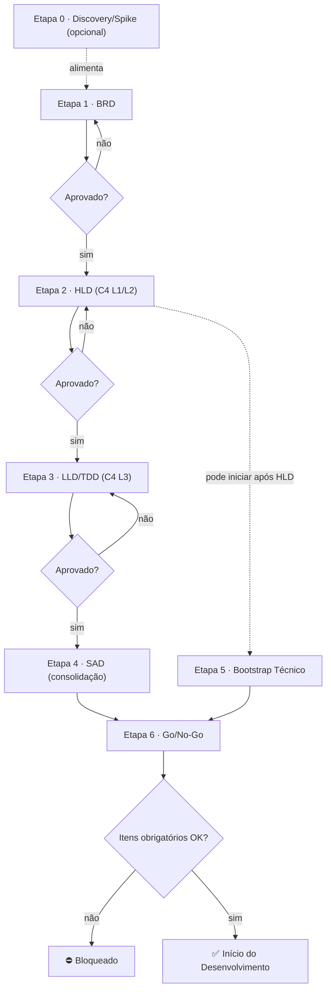

# Day Zero Playbook

*Clear the gates before your first line of code.* · v1.0 · Owner: Time de Arquitetura · Revisão trimestral

Playbook de prontidão de projetos de software. Define os **artefatos obrigatórios** e o **workflow de aprovação** que todo projeto percorre **antes de qualquer linha de código**, da concepção do negócio até a autorização formal de início do desenvolvimento (gate Go/No-Go).

## Por que ele existe

Projetos que começam a codar sem alinhamento formal entre negócio e tecnologia acumulam retrabalho, decisões sem dono e requisitos que ninguém testa. O Day Zero Playbook ataca isso com três mecanismos:

- **Gates objetivos**: cada etapa tem critério de entrada (DoR) e de aceite (DoD) verificáveis; aprovação não é subjetiva.
- **Segregação de funções**: quem produz um artefato nunca é quem o aprova.
- **Handoff autossuficiente**: o artefato de cada etapa deve bastar para que outro time execute a etapa seguinte sem depender do time anterior. É o que permite alternar times internos, contratados e parceiros ao longo do fluxo.

O rigor **escala com a criticidade** do projeto (tailoring): projetos de criticidade Baixa seguem uma Trilha Leve (BRD + HLD combinados em um one-pager); projetos Críticos seguem o fluxo integral. BRD e Go/No-Go nunca são dispensados.

## O workflow



A especificação completa está no documento principal: princípios, papéis e RACI, fluxo de aprovação e reprovação, estimativa progressiva, gestão de mudanças, métricas do processo, baseline de segurança, tailoring e glossário.

📘 **[`day-zero-playbook.md`](./day-zero-playbook.md)**

## O que tem neste repositório

```
.
├── day-zero-playbook.md             # O playbook (documento normativo)
├── CHANGELOG.md                     # Histórico de versões
├── Templates/                       # Um template por artefato; copie e preencha
└── Examples/                        # Um exemplo preenchido por template
```

Cada artefato do workflow tem um **template** pronto para copiar e um **exemplo preenchido**. Todos os exemplos usam o mesmo projeto fictício (**SAP-Peças**, um portal de autoatendimento de pedidos de peças) e são coerentes entre si do spike ao Go/No-Go: mesmos requisitos (RF/RNF), mesmos riscos (RISK-NNN), mesmas decisões (ADR-NNN), mesmos personagens. Juntos, formam um caso de referência completo e navegável.

| Etapa | Artefato | Template | Exemplo |
| :---- | :---- | :---- | :---- |
| 0 | Spike / PoC Report | [template](./Templates/template-spike-poc.md) | [exemplo](./Examples/exemplo-spike-poc-preenchido.md) |
| 1 | Business Requirements Document (BRD) | [template](./Templates/template-brd.md) | [exemplo](./Examples/exemplo-brd-preenchido.md) |
| 2 | High-Level Design (HLD) | [template](./Templates/template-hld.md) | [exemplo](./Examples/exemplo-hld-preenchido.md) |
| 3 | Low-Level Design / TDD | [template](./Templates/template-lld-tdd.md) | [exemplo](./Examples/exemplo-lld-tdd-preenchido.md) |
| 4 | Solution Architecture Document (SAD) | [template](./Templates/template-sad.md) | [exemplo](./Examples/exemplo-sad-preenchido.md) |
| 5 | Checklist de Bootstrap Técnico | [template](./Templates/template-bootstrap.md) | [exemplo](./Examples/exemplo-bootstrap-preenchido.md) |
| 6 | Checklist de Go / No-Go | [template](./Templates/template-go-no-go.md) | [exemplo](./Examples/exemplo-go-no-go-preenchido.md) |
| 2-4 | Architecture Decision Record (ADR) | [template](./Templates/template-adr.md) | [exemplo](./Examples/exemplo-adr-preenchido.md) |
| Transversal | Registro de Riscos | [template](./Templates/template-registro-riscos.md) | [exemplo](./Examples/exemplo-registro-riscos-preenchido.md) |
| Transversal | Matriz de Rastreabilidade | [template](./Templates/template-matriz-rastreabilidade.md) | [exemplo](./Examples/exemplo-matriz-rastreabilidade-preenchida.md) |

## Como usar

**Se você vai conduzir um projeto novo:**

1. Leia o [documento principal](./day-zero-playbook.md), em especial os Capítulos 3 (quem produz e quem aprova cada etapa) e 8 (qual trilha seu projeto segue, conforme a criticidade).
2. Para cada etapa, copie o template correspondente, preencha os campos `<...>` e remova as instruções em *itálico*. Use o exemplo preenchido como gabarito.
3. Só avance de etapa com o **DoD atendido e a aprovação formal registrada** no Repositório de Documentação (a ferramenta acordada entre as partes no início do projeto, ex: Confluence, SharePoint, wiki do Git) ou por e-mail com o solicitante.
4. O **Go/No-Go** (Etapa 6) autoriza (ou bloqueia) o início do desenvolvimento. Todos os itens obrigatórios (e condicionais aplicáveis) precisam estar concluídos, com evidência.

**Se você é aprovador:** seu papel, SLA de revisão (3 dias úteis) e o fluxo de reprovação estão no Capítulo 4. Você nunca aprova um artefato que produziu.

**Se você quer só entender o espírito da coisa:** leia o [exemplo de Go/No-Go](./Examples/exemplo-go-no-go-preenchido.md) e navegue pelos links: ele amarra todos os artefatos do caso de referência.

## Vocabulário

O Day Zero Playbook é organizado internamente em **Capítulos** (1-10, partes do documento) e **Etapas** (0-6, passos do workflow). Ele cobre a prontidão **pré-desenvolvimento**; os temas seguintes (segurança, deploy, code review, encerramento) são companheiros no roadmap, tratados fora deste playbook.

| Escopo | Status |
| :---- | :---- |
| **Day Zero Playbook** — prontidão pré-desenvolvimento (este repositório) | Publicado (v1.0) |
| Segurança: configurações obrigatórias | Em elaboração |
| Desenvolvimento & Code Review · Deploy & Operação · Encerramento & Handover | Roadmap (pós–Day Zero) |

## Fora do escopo

O que vem depois do Go/No-Go — branches, issues, code review, QA e encerramento — fica **fora do escopo** do Day Zero Playbook e é definido pelas **convenções da própria equipe**; o playbook só pede que sejam registradas no Bootstrap Técnico. Segurança tem tratamento próprio: enquanto o companheiro de Segurança não é publicado, vale o **baseline mínimo de segurança** do Capítulo 7 do documento principal.

## Versionamento e contribuição

O Day Zero Playbook usa versionamento semântico próprio; ver [`CHANGELOG.md`](./CHANGELOG.md). O documento é revisado trimestralmente pelo Time de Arquitetura, alimentado pelas métricas do processo (Capítulo 4.4). Sugestões de mudança: abra uma issue ou procure o Time de Arquitetura.
