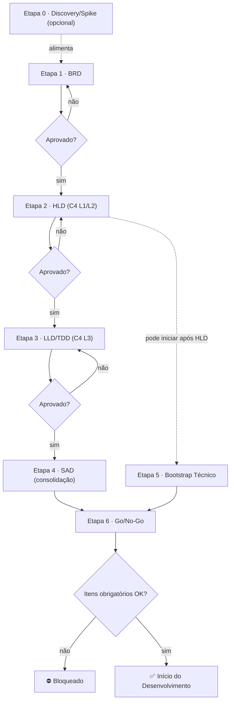

| Day Zero Playbook · Artefatos, Documentação e Workflow de Aprovação · v1.0 · Owner: Time de Arquitetura · Revisão: trimestral · Última atualização: Junho 2026 |
| :---- |

> **Como ler este documento.** O Day Zero Playbook se divide internamente em **Capítulos** (1 a 10) e descreve as **Etapas** (0 a 6) do workflow — tudo o que um projeto resolve **antes da primeira linha de código**. Referências do tipo "Capítulo 7" apontam para dentro deste documento; "Etapa 3" aponta para uma etapa do workflow. Temas posteriores (segurança, deploy, code review, encerramento) são **companheiros no roadmap**, tratados fora deste playbook.

# Capítulo 1: Visão Geral

Este playbook define os artefatos obrigatórios e o workflow que todo projeto deve seguir **antes de qualquer linha de código ser escrita**. O objetivo é simples de enunciar e difícil de sustentar: negócio e tecnologia alinhados, cada decisão com rastro, e menos retrabalho nascido de projeto começado às pressas.

As etapas a seguir podem ser executadas por times diferentes (interno, contratado ou time parceiro). Por isso, este playbook adota duas garantias inegociáveis:

- **Pacote de handoff autossuficiente:** o artefato de cada etapa deve ser completo o bastante para que o time da etapa seguinte continue **sem depender do time anterior**.
- **Segregação de funções:** quem **produz** um artefato nunca é quem o **aprova**.

| ⚠️ OBRIGATÓRIO | *Nenhum projeto pode iniciar desenvolvimento sem que todos os artefatos desta seção estejam formalizados, aprovados e registrados no **Repositório de Documentação**: a ferramenta de documentação **acordada entre as partes no início do projeto** (ex: Confluence, SharePoint, wiki do Git) e registrada no BRD. Quando aplicável, vale também o registro por e-mail com o solicitante.* |
| :---: | :---- |

## 1.1 Índice deste documento

| Capítulo | Conteúdo |
| :---- | :---- |
| **1** | Visão Geral, índice, roadmap e diagrama do workflow |
| **2** | Princípios do Playbook |
| **3** | Papéis e Responsabilidades (glossário de papéis + RACI) |
| **4** | Workflow Geral (fluxo de aprovação, estimativa, mudanças) |
| **Etapas 0-6** | Detalhe de cada etapa (Discovery, BRD, HLD, LLD/TDD, SAD, Bootstrap, Go/No-Go) |
| **5** | Registro de Riscos |
| **6** | Matriz de Rastreabilidade |
| **7** | Baseline Mínimo de Segurança |
| **8** | Tailoring por Criticidade |
| **9** | Resumo de Artefatos e Onde Armazenar |
| **10** | Glossário e Acrônimos |

## 1.2 Roadmap (companheiros futuros)

| Escopo | Status |
| :---- | :---- |
| **Day Zero Playbook** — prontidão pré-desenvolvimento (este documento) | Publicado (v1.0) |
| Segurança: configurações obrigatórias | Em elaboração |
| Desenvolvimento & Code Review · Deploy & Operação · Encerramento & Handover | Roadmap (pós–Day Zero) |

## 1.3 Fronteira deste documento

Este documento cobre **da concepção do negócio até a autorização de início do desenvolvimento** (gate Go/No-Go). O que vem depois (padrões de código, fluxo de branches, code review, encerramento) é tratado em documentos próprios da organização, que **devem ser referenciados** ao final do Bootstrap Técnico:

- **Estratégia de branches:** documento de Gitflow da organização.
- **Padrão de issues (HU/Task/Bug):** guia de escrita de issues da organização.
- **Verificação e encerramento de bugs:** processo de QA/encerramento da organização.
- **Segurança (configurações obrigatórias):** companheiro de Segurança, *em elaboração*. Até ele existir, vale o baseline mínimo do Capítulo 7 deste documento.

## 1.4 O Workflow em um diagrama

# Capítulo 2: Princípios do Playbook

| # | Princípio | O que significa na prática |
| :---- | :---- | :---- |
| **P1** | **Produtor ≠ Aprovador** | Quem escreve o artefato não pode ser quem dá o aprovado final da etapa. |
| **P2** | **Handoff autossuficiente** | O teste de qualidade de um artefato é: "um time que não o escreveu consegue produzir a etapa seguinte só com ele?". |
| **P3** | **Rastreabilidade ponta a ponta** | Todo requisito (RF/RNF) é rastreável até um componente de design e até um caso de teste. |
| **P4** | **Operabilidade e risco entram cedo** | Deploy, observabilidade, DR e riscos são decididos no HLD/LLD, não no fim. |
| **P5** | **Gate objetivo** | Cada etapa tem critério de entrada (DoR) e de aceite (DoD) verificáveis; aprovação não é subjetiva. |
| **P6** | **ADR no momento da decisão** | A decisão arquitetural é registrada quando é tomada; o SAD apenas a consolida. |
| **P7** | **SAD é documento vivo** | O SAD é montado a partir dos artefatos anteriores; não é retrabalho. |
| **P8** | **Tailoring por criticidade** | O rigor escala com a criticidade do projeto (ver Capítulo 8). O BRD e o Go/No-Go nunca são dispensados. |

# Capítulo 3: Papéis e Responsabilidades

## 3.1 Glossário de papéis

| Papel | Quem é | Responsabilidade principal |
| :---- | :---- | :---- |
| **Solicitante (Business Owner)** | Área de negócio dona do problema | Escreve e aprova o BRD; aprova custo e justificativa de negócio. |
| **PM (Gerente de Projeto)** | Interno ou time responsável | Conduz o fluxo, cronograma, comunicação e o gate Go/No-Go. |
| **Tech Lead (Produtor)** | Interno ou contratado | Lidera a produção técnica (HLD, coordenação do LLD). |
| **Arquiteto** | Interno ou contratado | Desenha a arquitetura (HLD, SAD) e registra ADRs. |
| **Dev Lead** | Interno ou contratado | Detalha o LLD/TDD e o Bootstrap Técnico. |
| **UX Designer** | Interno ou contratado | Produz protótipo/wireframes quando o projeto possui UI; valida acessibilidade junto ao Solicitante. |
| **Tech Lead Aprovador** | **Designado pela organização** | Autoridade de aprovação técnica das Etapas 0-5. Guardião do processo. Nunca aprova um artefato que ele próprio produziu (P1). |
| **Segurança / DPO** | Interno | Avalia segurança e LGPD; aprova o gate de segurança. |

## 3.2 Matriz RACI por etapa

R = Responsável (produz) · A = Aprova · C = Consultado · I = Informado

| Etapa | Solicitante | PM | Produtor (Arq./Dev Lead) | Tech Lead Aprovador | Segurança/DPO |
| :---- | :----: | :----: | :----: | :----: | :----: |
| **0. Discovery/Spike** | C | C | R | A | C |
| **1. BRD** | R/A | A | C | C | C |
| **2. HLD** | I | I | R | A | C |
| **3. LLD/TDD** | I | I | R | A | C |
| **4. SAD** | I | C | R | A | C |
| **5. Bootstrap Técnico** | I | C | R | A | C |
| **6. Go/No-Go** | A | R | C | A | A |

# Capítulo 4: Workflow Geral

O processo é composto por **6 etapas obrigatórias** (1 a 6) e **1 etapa opcional** (a Etapa 0, de Discovery). Cada etapa depende da aprovação da anterior. Etapas não podem ser puladas; paralelização só é permitida quando explicitamente autorizada nesta tabela.

| # | Etapa | Artefato Principal | Produtor | Aprovado por | Paralelização |
| :---- | :---- | :---- | :---- | :---- | :---- |
| **0** | **Discovery / Spike** *(opcional)* | Spike / PoC Report | Arquiteto / Dev Lead | Tech Lead Aprovador | Precede a Etapa 1 quando exigida |
| **1** | **Levantamento de Negócio** | Business Requirements Document (BRD) | Solicitante | PM (+ Solicitante p/ negócio) | - |
| **2** | **Design de Alto Nível** | High-Level Design (HLD) + C4 L1-L2 | Arquiteto / Tech Lead | Tech Lead Aprovador | - |
| **3** | **Design de Baixo Nível** | Low-Level Design (LLD) + TDD + C4 L3 | Dev Lead / Arquiteto | Tech Lead Aprovador | - |
| **4** | **Documento de Arquitetura** | Solution Architecture Document (SAD), *vivo* | Arquiteto | Tech Lead Aprovador | Mantido ao longo das Etapas 2-4 |
| **5** | **Bootstrap Técnico** | Repo + Gitflow + CI/CD + Ambientes + Segredos | Dev Lead / DevOps | Tech Lead Aprovador | **Pode iniciar após a Etapa 2 aprovada** |
| **6** | **Aprovação Final** | Checklist de Go/No-Go | PM / Tech Lead | Solicitante + Tech Lead Aprovador + Segurança | - |

## 4.1 Fluxo de Aprovação, Reprovação e Rework

Toda etapa termina em uma decisão formal do aprovador. O caminho de reprovação é parte do processo:

- **Aprovado:** registrado no Repositório de Documentação ou por e-mail; libera a etapa seguinte.
- **Reprovado:** o aprovador registra **motivos objetivos** (referenciando o critério de aceite da etapa). O produtor corrige e ressubmete.
- **SLA de revisão:** o aprovador tem **3 dias úteis** para revisar cada submissão. Cada aprovador deve ter um **suplente** designado para não bloquear o fluxo.
- **Limite de iterações:** após **3 ciclos de reprovação** na mesma etapa, o caso é escalado ao Time de Arquitetura para decisão (replanejar escopo, trocar abordagem ou cancelar).

## 4.2 Política de Estimativa Progressiva

A estimativa de custo/prazo **não é um número único**. Ela é registrada no BRD (ordem de grandeza) e **reestimada obrigatoriamente** em dois pontos: após o **HLD** (estimativa de arquitetura/infra) e após o **LLD** (estimativa de esforço de desenvolvimento). Variações acima de **±25%** entre estimativas exigem ciência formal do Solicitante.

## 4.3 Gestão de Mudanças

Alterações de escopo após qualquer aprovação exigem: (a) atualização dos artefatos afetados, (b) reavaliação de risco e estimativa, e (c) **re-aprovação pelos mesmos aprovadores** das etapas impactadas.

## 4.4 Métricas do Processo

Um playbook que não se mede não evolui. O Time de Arquitetura acompanha, por trimestre:

| Métrica | O que indica |
| :---- | :---- |
| **Lead time por etapa** | Tempo entre submissão e aprovação. Etapas lentas indicam gargalo de aprovadores ou artefatos malformados. |
| **Ciclos de reprovação por etapa** | Reprovações recorrentes na mesma etapa indicam critérios de aceite mal compreendidos ou template insuficiente. |
| **Variação de estimativa (BRD → LLD)** | Variações sistemáticas acima de ±25% indicam BRDs fracos ou discovery insuficiente (rever uso da Etapa 0). |
| **Retrabalho pós-Go** | Mudanças de escopo/arquitetura após o Go/No-Go. É o indicador final da qualidade do processo. |

Os resultados alimentam a revisão trimestral deste documento (ver cabeçalho).

# Etapa 0: Discovery / Spike *(opcional)*

Etapa de redução de incerteza **antes** de comprometer o BRD/arquitetura. É **timeboxed** e gera aprendizado, não código de produção.

**Quando é exigida:** tecnologia nova/não dominada pelo time; viabilidade técnica incerta; integração externa sem contrato conhecido; ou risco técnico classificado como Alto no levantamento inicial. Para projetos sem esses fatores, a Etapa 0 é dispensada.

**Entrada (DoR):** oportunidade/ideia registrada e uma pergunta de viabilidade clara a responder ("é possível X dentro de Y?").

## Conteúdo do Spike / PoC Report

| Seção | Descrição |
| :---- | :---- |
| **Pergunta de Viabilidade** | A hipótese a validar, com critério objetivo de sucesso/falha. |
| **Timebox** | Esforço máximo alocado (ex: 3-5 dias). |
| **Experimento** | O que foi construído/testado (descartável). |
| **Resultado** | Validado / Invalidado / Inconclusivo, com evidências. |
| **Impacto no Projeto** | Premissas confirmadas/derrubadas que alimentam BRD e HLD. |
| **Recomendação** | Seguir / pivotar / não seguir. |

| ✅ DoD da Etapa 0 | *Pergunta de viabilidade respondida com evidência; recomendação registrada; premissas resultantes prontas para entrar no BRD/HLD. O código do spike é descartável e não vai para produção.* |
| :---: | :---- |

# Etapa 1: Business Requirements Document (BRD)

O BRD é o ponto de partida. Documenta o problema de negócio, objetivos, escopo e stakeholders. Deve ser escrito e aprovado pelo solicitante antes de qualquer atividade técnica.

**Entrada (DoR):** problema de negócio identificado e patrocinador (Solicitante) definido. Se houve Etapa 0, os achados do spike estão disponíveis.

## Conteúdo Obrigatório do BRD

| Seção | Descrição |
| :---- | :---- |
| **Contexto e Problema** | Descrição da situação atual (as-is), a dor de negócio e por que o projeto é necessário agora. |
| **Objetivo de Negócio** | O que se espera alcançar. Deve ser mensurável (ex: reduzir tempo de processo em X%). |
| **Escopo** | O que está dentro e fora do escopo. Inclui integrações, sistemas impactados e exclusões explícitas. |
| **Stakeholders** | Lista de envolvidos: solicitante, usuários finais, responsável técnico, aprovadores. |
| **Requisitos Funcionais** | Lista priorizada das funcionalidades (formato: RF-001, RF-002…). Base da matriz de rastreabilidade (Capítulo 6). |
| **Requisitos Não-Funcionais** | Performance, disponibilidade, segurança, idiomas, acessibilidade (ex: WCAG 2.1 AA), SLA esperado. **Cada RNF deve ser mensurável** (formato: RNF-001…). |
| **Critérios de Aceite** | Condições que definem quando o projeto está "pronto" para o negócio. |
| **Processo As-Is / To-Be** | Mapeamento do processo atual e do novo fluxo proposto. |
| **Restrições e Premissas** | Limitações conhecidas (tecnologia, prazo, orçamento) e premissas assumidas. |
| **Riscos de Negócio (inicial)** | Primeira versão do Registro de Riscos (Capítulo 5), com riscos de negócio conhecidos. |
| **Custo Estimado (ordem de grandeza)** | Estimativa inicial em duas parcelas: **construção** (desenvolvimento + infra de projeto) e **custo recorrente anual** (TCO de operação: infra, licenças, suporte). Aprovada pelo solicitante; será refinada (Capítulo 4, Estimativa Progressiva). |
| **Justificativa de Negócio** | Parágrafo obrigatório com ROI ou motivação estratégica, assinado pelo solicitante. |

## Definições Obrigatórias no BRD

| Dimensão | Opções | Impacto no Projeto |
| :---- | :---- | :---- |
| **Criticidade** | Baixa / Média / Alta / Crítica | Define SLA, monitoramento, deploy, nível de testes **e o tailoring do processo (Capítulo 8)**. |
| **Nº de Usuários** | Estimativa inicial e pico esperado | Define autoscaling, cache e dimensionamento de infra. |
| **Multi-idioma** | Sim / Não (PT, ES, EN…) | Define uso de i18n desde a concepção; não pode ser adicionado depois. |
| **Autoscaling** | Necessário / Não necessário | Define arquitetura de infra (auto-scaling vs. instâncias fixas). |
| **Dados Pessoais (LGPD)** | Coleta / Não coleta | Obriga avaliação de impacto LGPD antes do início do desenvolvimento. |
| **Classificação de Dados** | Público / Interno / Confidencial / Restrito | Define criptografia, controle de acesso e retenção. |
| **Requisitos Regulatórios / Compliance** | Lista (LGPD, PCI-DSS, SOC 2, setoriais…) | Define controles, trilhas de auditoria e gates de conformidade aplicáveis ao domínio. |
| **Integrações Externas** | Lista de sistemas/APIs | Define dependências, riscos e prazo de homologação com terceiros. |
| **Disponibilidade / DR** | RTO e RPO esperados | Define estratégia de backup, redundância e recuperação de desastre. |
| **Interface de Usuário (UX)** | Possui UI / Não possui | Quando há UI, exige protótipo/wireframes aprovados pelo Solicitante **antes do LLD (Etapa 3)** e validação de acessibilidade. |
| **Uso de IA** | Usa IA/LLM / Não usa | Quando há componente de IA, exige avaliação de risco de IA (dados, viés, privacidade, conformidade, ex: ISO/IEC 42001) antes do Go/No-Go. |

| ✅ DoD da Etapa 1 (BRD) | *Todas as seções preenchidas; RFs e RNFs codificados e mensuráveis; criticidade, classificação de dados e compliance definidos; justificativa de negócio assinada; riscos de negócio iniciais registrados. Handoff: o time da Etapa 2 consegue projetar a arquitetura só com o BRD.* |
| :---: | :---- |

# Etapa 2: High-Level Design (HLD)

O HLD traduz os requisitos de negócio em uma visão técnica de alto nível: arquitetura macro, componentes principais, integrações e decisões tecnológicas.

**Entrada (DoR):** BRD aprovado (DoD da Etapa 1 atendido).

## Conteúdo Obrigatório do HLD

| Seção | Descrição |
| :---- | :---- |
| **Visão Geral da Arquitetura** | Estilo arquitetural adotado (microsserviços, monolito modular, serverless) com justificativa. |
| **Diagrama de Contexto (C4 L1)** | O sistema como caixa preta, usuários e sistemas externos. Ver Modelo C4 nesta etapa. |
| **Diagrama de Contêineres (C4 L2)** | Apps, APIs, bancos de dados, filas. Ver Modelo C4 nesta etapa. |
| **Stack Tecnológica** | Linguagens, frameworks, bancos, serviços de nuvem e justificativas. |
| **Análise Build vs Buy vs Open Source** | Para os componentes principais: construir, comprar (SaaS/COTS) ou adotar open source, com critérios objetivos (TCO, prazo, aderência ao requisito, lock-in, maturidade) e decisão registrada em ADR. |
| **Topologia de Infraestrutura** | VPC, subnets, load balancers, regiões de nuvem, estratégia de rede. |
| **Fluxo de Dados Principal** | Como o dado percorre o sistema, com transformações e armazenamentos. |
| **Integrações e APIs Externas** | Todas as integrações, protocolos, contratos esperados e dependências. |
| **Estratégia de Segurança** | Autenticação, autorização, criptografia, pontos de entrada protegidos. Threat modeling inicial (Capítulo 7). |
| **Estratégia de Escalabilidade** | Resposta ao aumento de carga (horizontal/vertical, auto-scaling). |
| **Estratégia de Deploy (preliminar)** | Abordagem pretendida (blue/green, canary, rolling), pois impacta a infra. |
| **Estratégia de Observabilidade (preliminar)** | O que será monitorado e quais SLIs/SLOs candidatos, pois impacta o design dos componentes. |
| **Requisitos de DR** | RTO/RPO e estratégia macro de recuperação. |
| **Riscos Técnicos** | Atualização do Registro de Riscos (Capítulo 5) com riscos de arquitetura. |
| **Pontos de Decisão Técnica (ADR)** | ADRs das decisões tomadas neste nível (P6). |

## Modelo C4: Níveis Exigidos no HLD

O Modelo C4 (Context, Containers, Components, Code) é o padrão de diagramação adotado neste playbook. No HLD são obrigatórios os níveis 1 e 2.

| Nível | Nome | O que mostra | Etapa | Ferramenta sugerida |
| :---- | :---- | :---- | :---- | :---- |
| **L1** | **Context** | O sistema, usuários e sistemas externos. "O que é o sistema?" | **HLD** | Draw.io / Miro |
| **L2** | **Containers** | Web app, API, banco, fila. "Como é construído?" | **HLD** | Draw.io / Miro |
| **L3** | **Components** | Módulos, serviços e classes dentro de cada contêiner. "O que há dentro?" | LLD | Draw.io / PlantUML |
| **L4** | **Code** | Classes e interfaces (UML). Gerado quando necessário. | Opcional | PlantUML / IDE |

| 💡 DICA | *Use Structurizr DSL ou Draw.io com template C4 para consistência visual. Os diagramas devem estar versionados no repositório Git ou no Repositório de Documentação.* |
| :---: | :---- |

| ✅ DoD da Etapa 2 (HLD) | *C4 L1 e L2 presentes; stack justificada; análise build vs buy registrada para os componentes principais; integrações mapeadas; estratégias de segurança, deploy, observabilidade e DR definidas em nível macro; ADRs registrados; riscos técnicos atualizados; reestimativa registrada. Handoff: o time da Etapa 3 detalha o LLD só com o HLD.* |
| :---: | :---- |

# Etapa 3: Low-Level Design (LLD) e Technical Design Document (TDD)

O LLD/TDD detalha como cada componente será implementado. É a referência dos desenvolvedores durante a codificação.

**Entrada (DoR):** HLD aprovado; stack e integrações definidas. Se o projeto possui interface de usuário, protótipo/wireframes aprovados pelo Solicitante.

## Conteúdo Obrigatório do LLD/TDD

| Seção | Descrição |
| :---- | :---- |
| **Diagrama de Componentes (C4 L3)** | Módulos internos de cada contêiner: responsabilidades e interfaces. |
| **Modelo de Dados** | Diagrama ER, esquema do banco, naming conventions, índices e constraints. |
| **Definição de APIs e Contratos** | Especificação OpenAPI/Swagger de todos os endpoints: métodos, payloads, respostas, erros e autenticação. |
| **Fluxos de Processo Detalhados** | Diagramas de sequência/UML dos principais casos de uso e fluxos alternativos. |
| **Estratégia de Tratamento de Erros** | Como erros são capturados, logados, retornados e notificados. |
| **Estratégia de Cache** | O que é cacheado, TTL, invalidação e ferramenta (Redis, CloudFront…). |
| **Instrumentação de Observabilidade** | Logs, métricas e traces **por componente**; mapeamento até os SLIs/SLOs definidos no HLD. |
| **Pontos de Rollback / Feature Flags** | Como cada mudança pode ser revertida com segurança. |
| **Migrations e Versionamento de Schema** | Plano de migrations, ferramenta (Flyway, Liquibase, Alembic) e rollback. |
| **Estratégia de Testes** | Tipos (unitário, integração, E2E), cobertura mínima, ferramentas, responsáveis e **gestão de dados/ambientes de teste**. |
| **Dependências e Bibliotecas** | Lista com versão, **licença** e justificativa de uso. |
| **Considerações de Performance** | Pontos críticos, benchmarks esperados e estratégias de otimização. |

## Diagramas Obrigatórios no LLD

| Diagrama | Quando usar | Ferramenta |
| :---- | :---- | :---- |
| **Diagrama de Sequência** | Fluxos com múltiplos atores e serviços (autenticação, checkout, webhook). | PlantUML / Miro |
| **Diagrama ER / Schema** | Todo projeto com banco relacional. | dbdiagram.io / draw.io |
| **Diagrama de Componentes C4 L3** | Sistemas com mais de 3 contêineres ou módulos internos complexos. | Structurizr / draw.io |
| **Diagrama de Estado** | Entidades com ciclo de vida complexo (pedido, documento, aprovação). | PlantUML / draw.io |
| **Diagrama de Atividade / Fluxo** | Processos com ramificações, decisões e loops relevantes. | Lucidchart / draw.io |

| ✅ DoD da Etapa 3 (LLD) | *C4 L3, modelo de dados e contratos OpenAPI completos; observabilidade e rollback definidos por componente; estratégia de testes definida (com dados/ambientes de teste); matriz de rastreabilidade (Capítulo 6) preenchida; reestimativa de esforço registrada. Handoff: um desenvolvedor implementa só com o LLD.* |
| :---: | :---- |

# Etapa 4: Solution Architecture Document (SAD)

O SAD é o **documento vivo** que consolida as decisões de HLD e LLD num registro único de referência. É **mantido ao longo das Etapas 2 a 4** e finalizado nesta etapa; não é produção nova. A aprovação aqui é **revisão de consistência e completude**, não reescrita.

**Entrada (DoR):** HLD e LLD aprovados.

## Estrutura do SAD

| # | Seção | Conteúdo | Origem |
| :---- | :---- | :---- | :---- |
| **1** | **Visão Geral** | Sumário executivo, objetivo, escopo e contexto. | BRD |
| **2** | **Requisitos e Restrições** | RFs/RNFs relevantes à arquitetura; restrições técnicas e de negócio. | BRD |
| **3** | **Decisões Arquiteturais (ADR)** | Consolidação dos ADRs registrados nas Etapas 2-3. | HLD/LLD |
| **4** | **Visão Arquitetural** | C4 L1, L2 e L3; componentes, responsabilidades e interações. | HLD/LLD |
| **5** | **Infraestrutura e Deploy** | Topologia de nuvem, pipeline CI/CD, estratégia de deploy (blue/green, canary, rolling). | HLD/Bootstrap |
| **6** | **Segurança** | Modelo de ameaças e controles aplicados (Capítulo 7 / companheiro de Segurança). | HLD/LLD |
| **7** | **Observabilidade** | Logs, métricas, traces, alertas, dashboards e SLIs/SLOs. | HLD/LLD |
| **8** | **Estratégia de Dados** | Modelo de dados, classificação, retenção, backup, compliance LGPD. | BRD/LLD |
| **9** | **Riscos e Mitigações** | Consolidação do Registro de Riscos (Capítulo 5). | Todas |
| **10** | **Cronograma e Marcos** | Etapas de desenvolvimento, datas de revisão e go-live previsto. | PM |
| **11** | **Glossário** | Termos técnicos e de negócio. | - |
| **12** | **Histórico de Revisões** | Controle de versão: data, autor e descrição das mudanças. | - |

## Architecture Decision Records (ADR)

Cada decisão arquitetural relevante é registrada como ADR **no momento em que é tomada** (Etapa 2 em diante). O ADR é curto e imutável: decisões não são deletadas, apenas supercedidas por novos ADRs.

| Campo ADR | Descrição |
| :---- | :---- |
| **Título** | ADR-NNN: Descrição curta (ex: "ADR-001: PostgreSQL como banco principal"). |
| **Status** | Proposta / Aceita / Deprecada / Supercedida por ADR-NNN. |
| **Contexto** | Qual problema ou situação motivou a decisão? |
| **Decisão** | O que foi decidido, de forma clara e direta. |
| **Alternativas consideradas** | Outras opções avaliadas. |
| **Consequências** | Impactos positivos e negativos (trade-offs). |

| ✅ DoD da Etapa 4 (SAD) | *Todas as 12 seções consolidadas e consistentes com HLD/LLD; ADRs e Registro de Riscos integrados; versionado no Repositório de Documentação. Sem contradições entre seções.* |
| :---: | :---- |

# Etapa 5: Bootstrap Técnico

Esta etapa transforma a arquitetura aprovada em um ambiente pronto para desenvolver. **Pode iniciar assim que o HLD (Etapa 2) for aprovado**, em paralelo às Etapas 3 e 4. Resolve os itens de prontidão que antes não tinham etapa de origem.

**Entrada (DoR):** HLD aprovado (stack definida).

## Conteúdo Obrigatório

| Item | Descrição |
| :---- | :---- |
| **Repositório** | Repositório criado, com README, estrutura de pastas e CODEOWNERS. |
| **Estratégia de Branches** | Gitflow definido conforme o documento de Gitflow da organização. |
| **Pipeline CI/CD** | Build automatizado + **secrets scan** + lint + execução de testes. |
| **Gestão de Segredos** | Cofre de segredos definido (ex: AWS Secrets Manager / Parameter Store). **Nenhum segredo em repositório ou imagem.** |
| **Análise de Segurança no Pipeline** | SAST, SCA (dependências) e, quando aplicável, DAST; ver Capítulo 7. |
| **Ambientes** | dev/staging/prod provisionados ou com plano de provisionamento e tagging de custo (FinOps). |
| **Convenções de Código** | Referência ao padrão de código e ao padrão de issues da organização. |

| ✅ DoD da Etapa 5 (Bootstrap) | *Repositório e gitflow operacionais; pipeline executa build + secrets scan + SAST/SCA; segredos fora do código; ambientes provisionados ou planejados com tagging de custo.* |
| :---: | :---- |

# Etapa 6: Checklist de Go / No-Go

**Entrada (DoR):** Etapas 1 a 5 concluídas. Antes de iniciar o desenvolvimento, PM, Tech Lead Aprovador e Segurança validam o checklist. Todos os itens obrigatórios devem estar "Concluído". Itens pendentes bloqueiam o início. Itens **Condicionais** são obrigatórios quando a dimensão correspondente do BRD se aplica (UI, IA); caso contrário, marcam-se "N/A".

| # | Item | Obrigatoriedade | Status |
| :---- | :---- | :---- | :---- |
| **1** | BRD escrito, revisado e aprovado pelo solicitante | **Obrigatório** | ☐ Pendente |
| **2** | Justificativa de negócio (mín. 1 parágrafo) aprovada | **Obrigatório** | ☐ Pendente |
| **3** | Processo as-is e to-be mapeados | **Obrigatório** | ☐ Pendente |
| **4** | Custo estimado aprovado e reestimado após HLD e LLD (±25%) | **Obrigatório** | ☐ Pendente |
| **5** | Dimensões obrigatórias do BRD definidas (criticidade, usuários, multi-idioma, autoscaling, classificação de dados, compliance, UX, uso de IA) | **Obrigatório** | ☐ Pendente |
| **6** | Avaliação de impacto LGPD concluída e aprovada por Segurança/DPO | **Obrigatório** | ☐ Pendente |
| **7** | HLD elaborado com C4 L1 e L2 | **Obrigatório** | ☐ Pendente |
| **8** | Estratégias de deploy, observabilidade e DR (RTO/RPO) definidas | **Obrigatório** | ☐ Pendente |
| **9** | HLD aprovado pelo Tech Lead Aprovador (produtor ≠ aprovador) | **Obrigatório** | ☐ Pendente |
| **10** | LLD/TDD com modelo de dados e contratos de API | **Obrigatório** | ☐ Pendente |
| **11** | Matriz de rastreabilidade (RF → design → teste) preenchida | **Obrigatório** | ☐ Pendente |
| **12** | SAD consolidado e versionado no Repositório de Documentação | **Obrigatório** | ☐ Pendente |
| **13** | ADRs registrados para decisões relevantes | **Obrigatório** | ☐ Pendente |
| **14** | Registro de Riscos consolidado com mitigações | **Obrigatório** | ☐ Pendente |
| **15** | Repositório criado com estrutura e gitflow definidos | **Obrigatório** | ☐ Pendente |
| **16** | Pipeline CI/CD (build + secrets scan + SAST/SCA) configurado | **Obrigatório** | ☐ Pendente |
| **17** | Gestão de segredos definida (sem segredos no código) | **Obrigatório** | ☐ Pendente |
| **18** | Ambientes (dev/staging/prod) provisionados ou planejados | **Obrigatório** | ☐ Pendente |
| **19** | Estratégia de testes definida (unitário, integração, E2E) | **Obrigatório** | ☐ Pendente |
| **20** | Gate de segurança aprovado por Segurança/DPO | **Obrigatório** | ☐ Pendente |
| **21** | Equipe de desenvolvimento alocada, com papéis e capacidade confirmados | **Obrigatório** | ☐ Pendente |
| **22** | Protótipo/wireframes de UX aprovados pelo Solicitante | **Condicional** *(há UI)* | ☐ Pendente |
| **23** | Avaliação de risco de IA concluída (dados, viés, conformidade) | **Condicional** *(há IA)* | ☐ Pendente |
| **24** | Diagramas versionados no repositório Git ou no Repositório de Documentação | Recomendado | ☐ Pendente |
| **25** | Estratégia de observabilidade detalhada (dashboards, alertas) | Recomendado | ☐ Pendente |
| **26** | Estimativa de prazo alinhada com o solicitante | Recomendado | ☐ Pendente |

| ✅ CRITÉRIO DE APROVAÇÃO | *Todos os itens obrigatórios, e os condicionais aplicáveis, devem estar "Concluído" para autorizar o início. A aprovação final exige a tríade Solicitante + Tech Lead Aprovador + Segurança/DPO. Itens recomendados não bloqueiam, mas devem ter prazo definido para conclusão.* |
| :---: | :---- |

# Capítulo 5: Registro de Riscos

O Registro de Riscos é **iniciado no BRD** (riscos de negócio), **enriquecido no HLD/LLD** (riscos técnicos) e **consolidado no SAD**. É um artefato vivo.

| Campo | Descrição |
| :---- | :---- |
| **ID** | RISK-NNN |
| **Descrição** | O risco em uma frase. |
| **Categoria** | Negócio / Técnico / Segurança / Cronograma / Dependência externa. |
| **Probabilidade** | Baixa / Média / Alta. |
| **Impacto** | Baixo / Médio / Alto. |
| **Mitigação** | Ação para reduzir probabilidade ou impacto. |
| **Responsável** | Quem monitora o risco. |

# Capítulo 6: Matriz de Rastreabilidade

Garante que todo requisito foi desenhado e será testado (P3). Preenchida ao longo do HLD/LLD e validada no Go/No-Go (item 11).

| RF/RNF | Descrição | Componente (HLD/LLD) | Endpoint / API | Caso de Teste | Critério de Aceite |
| :---- | :---- | :---- | :---- | :---- | :---- |
| RF-001 | … | … | … | TC-001 | CA-001 |
| RNF-001 | … | … | - | TC-0NN | SLO-001 |

# Capítulo 7: Baseline Mínimo de Segurança

*Vigente até o companheiro de Segurança ser publicado. Quando ele existir, prevalece e este baseline torna-se o piso.*

| Controle | Exigência mínima |
| :---- | :---- |
| **Threat Modeling** | Análise STRIDE dos principais fluxos, registrada no HLD. |
| **Autenticação/Autorização** | Definidas no HLD; princípio de menor privilégio. |
| **Criptografia** | Em trânsito (TLS) e em repouso para dados Confidenciais/Restritos. |
| **Gestão de Segredos** | Cofre dedicado; nenhum segredo em repo, log ou imagem. |
| **Análise no Pipeline** | Secrets scan + SAST + SCA obrigatórios; DAST quando houver superfície web exposta. |
| **LGPD** | Avaliação de impacto (RIPD, conforme guia da ANPD) concluída quando há coleta de dados pessoais. |
| **Gate de Segurança** | Aprovação de Segurança/DPO no Go/No-Go (item 20). |

# Capítulo 8: Tailoring por Criticidade

O rigor do processo escala com a criticidade (P8). **BRD e Go/No-Go nunca são dispensados.** Simplificações exigem registro da decisão pelo Tech Lead Aprovador.

| Artefato | Baixa | Média | Alta | Crítica |
| :---- | :----: | :----: | :----: | :----: |
| **Etapa 0 (Discovery/Spike)** | Opcional | Opcional | Recomendado | Recomendado |
| **BRD** | ✔ | ✔ | ✔ | ✔ |
| **HLD (C4 L1/L2)** | Simplificado | ✔ | ✔ | ✔ |
| **Protótipo UX** *(quando há UI)* | Wireframe simples | ✔ | ✔ | ✔ |
| **LLD/TDD (C4 L3)** | Opcional | ✔ | ✔ | ✔ |
| **SAD** | Opcional | Simplificado | ✔ | ✔ |
| **Bootstrap Técnico** | ✔ | ✔ | ✔ | ✔ |
| **Threat Modeling formal** | - | Recomendado | ✔ | ✔ |
| **Go/No-Go** | ✔ | ✔ | ✔ | ✔ |

**Trilha Leve (criticidade Baixa):** o BRD e o HLD simplificado podem ser combinados em um **documento único** (estilo one-pager / design doc), desde que preserve: problema, objetivo mensurável, escopo, RF/RNF, dimensões obrigatórias do BRD, C4 L1 e stack com justificativa. As demais regras (produtor ≠ aprovador, registro formal, Go/No-Go) permanecem integrais.

# Capítulo 9: Resumo de Artefatos e Onde Armazenar

Na coluna Armazenamento, **Repositório de Documentação** é a ferramenta acordada entre as partes no início do projeto e registrada no BRD (ex: Confluence, SharePoint, wiki do Git).

| Artefato | Etapa | Produtor | Aprovação | Armazenamento |
| :---- | :---- | :---- | :---- | :---- |
| **Spike / PoC Report** | 0 | Arquiteto / Dev Lead | Tech Lead Aprovador | Repositório de Documentação |
| **Business Requirements Document (BRD)** | 1 | Solicitante + PM | PM (+ Solicitante) | Repositório de Documentação |
| **Process Map (as-is / to-be)** | 1 | Solicitante | PM | Repositório de Documentação / ferramenta de diagramas |
| **Protótipo / Wireframes (UX)** | 1→3 | UX Designer / Solicitante | Solicitante | Ferramenta de design / Repositório de Documentação |
| **Registro de Riscos** | 1→4 | Produtor | Tech Lead Aprovador | Repositório de Documentação |
| **High-Level Design (HLD)** | 2 | Arquiteto / TL | Tech Lead Aprovador | Repositório de Documentação |
| **Diagrama C4 L1 / L2** | 2 | Arquiteto / TL | Tech Lead Aprovador | Repositório de Documentação / Repo Git |
| **Low-Level Design / TDD** | 3 | Dev Lead / Arquiteto | Tech Lead Aprovador | Repositório de Documentação |
| **Diagrama C4 L3** | 3 | Dev Lead | Tech Lead Aprovador | Repositório de Documentação / Repo Git |
| **Diagrama ER / Schema** | 3 | Dev Lead | Tech Lead Aprovador | Repositório de Documentação / Repo Git |
| **Especificação OpenAPI / Swagger** | 3 | Dev Lead | Tech Lead Aprovador | Repositório Git |
| **Diagramas de Sequência** | 3 | Dev Lead | Tech Lead Aprovador | Repositório de Documentação / Repo Git |
| **Matriz de Rastreabilidade** | 2→3 | Produtor | Tech Lead Aprovador | Repositório de Documentação |
| **Solution Architecture Document (SAD)** | 4 | Arquiteto | Tech Lead Aprovador | Repositório de Documentação |
| **Architecture Decision Records (ADR)** | 2→4 | Arquiteto / TL | Tech Lead Aprovador | Repositório Git |
| **Configuração de Repo / CI/CD / Ambientes** | 5 | Dev Lead / DevOps | Tech Lead Aprovador | Repositório Git / IaC |
| **Checklist Go / No-Go** | 6 | PM / Tech Lead | Solicitante + TL Aprovador + Segurança | Repositório de Documentação / E-mail |

# Capítulo 10: Glossário e Acrônimos

| Termo | Significado |
| :---- | :---- |
| **ADR** | Architecture Decision Record: registro de decisão arquitetural. |
| **BRD** | Business Requirements Document: documento de requisitos de negócio. |
| **C4** | Modelo de diagramação em 4 níveis: Context, Containers, Components, Code. |
| **CI/CD** | Continuous Integration / Continuous Delivery. |
| **Compliance** | Conformidade com normas e regulamentos (LGPD, PCI-DSS, SOC 2…). |
| **DAST** | Dynamic Application Security Testing: teste de segurança em execução. |
| **DoD** | Definition of Done: critério de aceite/saída de uma etapa. |
| **DoR** | Definition of Ready: critério de entrada de uma etapa. |
| **DPO** | Data Protection Officer: Encarregado de Proteção de Dados. |
| **DR** | Disaster Recovery: recuperação de desastre. |
| **ER** | Entidade-Relacionamento (modelo de dados). |
| **FinOps** | Gestão financeira de custos de nuvem. |
| **HLD** | High-Level Design: design de alto nível. |
| **IaC** | Infrastructure as Code. |
| **i18n** | Internationalization: internacionalização. |
| **LGPD** | Lei Geral de Proteção de Dados. |
| **LLD** | Low-Level Design: design de baixo nível. |
| **LLM** | Large Language Model: modelo de linguagem de grande porte (componente de IA). |
| **MoSCoW** | Priorização: Must / Should / Could / Won't. |
| **PoC** | Proof of Concept: prova de conceito. |
| **RACI** | Responsible, Accountable, Consulted, Informed. |
| **Repositório de Documentação** | Ferramenta de documentação formal **acordada entre as partes no início do projeto** e registrada no BRD (ex: Confluence, SharePoint, wiki do Git). Onde os artefatos e aprovações são registrados. |
| **RF / RNF** | Requisito Funcional / Requisito Não-Funcional. |
| **RIPD** | Relatório de Impacto à Proteção de Dados Pessoais (avaliação de impacto LGPD, conforme ANPD). |
| **RTO / RPO** | Recovery Time Objective / Recovery Point Objective. |
| **SAD** | Solution Architecture Document: documento de arquitetura da solução. |
| **SAST** | Static Application Security Testing: análise estática de segurança. |
| **SCA** | Software Composition Analysis: análise de dependências. |
| **SLA / SLI / SLO** | Service Level Agreement / Indicator / Objective. |
| **STRIDE** | Metodologia de threat modeling (Spoofing, Tampering, Repudiation, Information disclosure, DoS, Elevation of privilege). |
| **TCO** | Total Cost of Ownership: custo total de propriedade (construção + operação recorrente). |
| **TDD** | Technical Design Document (neste playbook; não confundir com Test-Driven Development). |
| **UX** | User Experience: experiência do usuário. |
| **WCAG** | Web Content Accessibility Guidelines: diretrizes de acessibilidade. |

## Observações Finais

- Todos os artefatos devem estar formalizados no Repositório de Documentação (ferramenta acordada entre as partes e registrada no BRD) ou por e-mail com o solicitante antes do início do desenvolvimento.
- Alterações de escopo após a aprovação seguem o Capítulo 4 (Gestão de Mudanças).
- O Tech Lead Aprovador é o guardião deste processo e pode exigir revisão de qualquer artefato a qualquer momento, respeitando sempre a segregação produtor ≠ aprovador.
- O tailoring por criticidade (Capítulo 8) permite simplificar artefatos; o BRD e o Go/No-Go nunca são dispensados.
- Dúvidas sobre a aplicação deste processo devem ser direcionadas ao Time de Arquitetura.

*Day Zero Playbook · v1.0 · Clear the gates before your first line of code.*
